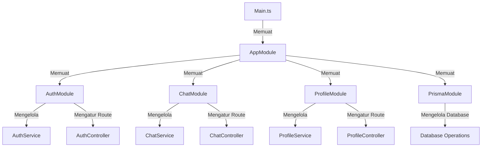
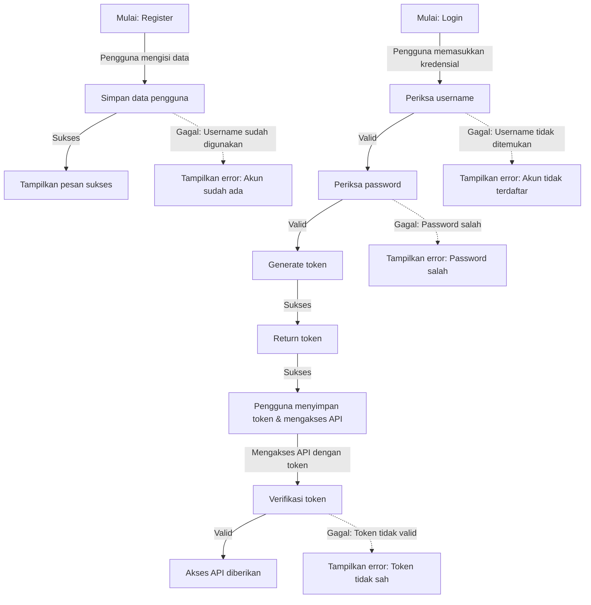
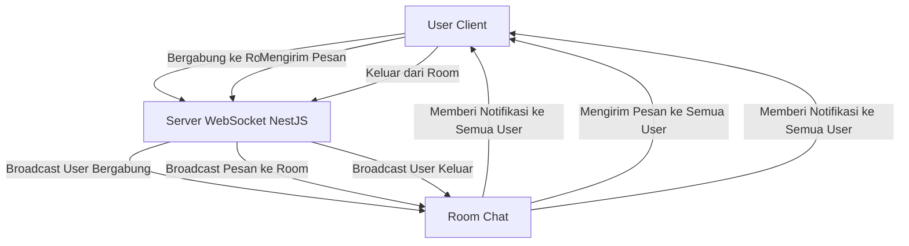

| Nama     | MAJERI         |
|----------|----------------|
| NIM      | 105841103622   | 
| Kelas    | 5A             | 
| LAB      | BACKEND        | 
-----------------------------


# Pengenalan Nest JS [1]

## A. Pendahuluan

NestJS adalah framework backend progresif yang berbasis TypeScript, meskipun juga dapat digunakan dengan JavaScript. Framework ini dirancang untuk membangun aplikasi server-side yang efisien, skalabel, dan mudah dipelihara. NestJS mengadopsi arsitektur modular dan memanfaatkan berbagai konsep modern dari Node.js, termasuk pola desain seperti Dependency Injection (DI) dan Inversion of Control (IoC). Dengan struktur yang mirip dengan Angular, NestJS memungkinkan pengembang yang sudah familiar dengan framework frontend tersebut untuk lebih mudah beradaptasi.

## B. Dasar-Dasar Backend

### 1. Apa itu Backend?

Backend adalah bagian dari pengembangan perangkat lunak yang berfungsi sebagai otak aplikasi. Tanggung jawab utama backend termasuk mengelola data, logika bisnis, autentikasi, dan komunikasi antara frontend dan database. Jika frontend adalah bagian yang terlihat oleh pengguna, backend berfungsi di belakang layar untuk memastikan semuanya berjalan dengan baik.

### 2. Komponen Utama Backend

- **Server**: Tempat program backend berjalan (contoh: Apache, Nginx).
- **Database**: Tempat penyimpanan data (contoh: MySQL, PostgreSQL, MongoDB).
- **API (Application Programming Interface)**: Cara backend berkomunikasi dengan frontend atau sistem lain.
- **Logika Bisnis**: Aturan dan proses yang menentukan bagaimana data diproses dan keputusan dibuat.

Berikut ini adalah struktur proyek **Lab-NestJS**:
```
📦lab-nestjs/
├── 📂node_modules/
├── 📂prisma/
│   ├── prisma.schema
├── 📂public/
│   ├── 🟨app.js
│   ├── 🟧index.html
│   ├── 🟦styles.css
├── 📂src/
│   ├── 📂chat/
│   |   |-- chat.gateaway.spec.ts
│   |   |-- chat.gateaway.ts
│   |   |-- chat.module.ts
│   |   |-- chat.service.spec.ts
│   |   |-- chat.service.ts
│   ├── 📂dto/
│   |   |-- create-mahasiswa.dto.ts
│   |   |-- register-user.dto.ts
│   ├── 📂entity/
│   |   |-- user.entity.ts
│   ├── 📂mahasiswa-profile/
│   |   |-- mahasiswa-profile.controller.spec.ts
│   |   |-- mahasiswa-profile.controller.ts
│   |   |-- mahasiswa-profile.module.ts
│   |   |-- mahasiswa-profile.service.spec.ts
│   |   |-- mahasiswa-profile.service.ts
│   ├── 📂profile/
│   |   |-- profile.controller.spec.ts
│   |   |-- profile.controller.ts
│   |   |-- profile.module.ts
│   |   |-- profile.service.spec.ts
│   |   |-- profile.service.ts
│   |-- app.controller.spec.ts
│   |-- app.controller.ts
│   |-- app.module.ts
│   |-- app.service.ts
│   |-- auth.guard.ts
│   |-- auth.module.ts
│   |-- 🟦main.ts
│   |-- 🟦prisma.ts
│   |-- 🟦user.decorator.ts
├── 📂test/
├── 📂uploads/
├── .env
├── .gitignore
├── .prettierrc
├── nest-cli.json
├── package-lock.json 
├── package.json 
├── README.md 
├── tsconfig.build.json 
├── tsconfig.json 
```

---
## TEKNOLOGI YANG DIGUNAKAN
|Nama|Deskripsi|
|---|---|
|`NestJS`|Framework backend berbasis TypeScript|
|`TypeScript`|Sebagai bahasa pemrograman yang digunakan untuk membuat kode proyek.
|`Prisma`|ORM untuk database.
|`PostgreSQL`|Sebagai database yang digunakan dalam proyek.
|`Swagger`|Sebagai library untuk mengimplementasikan dokumentasi API menggunakan Swagger.
|`WebSockets`|Untuk komunikasi real-time dalam chat.
|`Socket.io`|Sebagai library untuk mengimplementasikan WebSocket.
|`JWT (JSON Web Token)`|Untuk autentikasi pengguna.
---


### 3. Proses Kerja Backend

1. **Frontend Request**: Pengguna melakukan tindakan, seperti mengklik tombol di aplikasi.
2. **Server Processing**: Backend menerima permintaan, memprosesnya sesuai logika bisnis, dan mengambil data dari database jika diperlukan.
3. **Response to Frontend**: Backend mengirimkan hasil pemrosesan ke frontend untuk ditampilkan kepada pengguna.

## C. Teknologi Backend Terkenal dalam JavaScript/TypeScript

### 1. Node.js

Node.js adalah runtime JavaScript yang berjalan di server, memungkinkan pengembang menggunakan JavaScript untuk backend dan menciptakan aplikasi yang cepat dan skalabel.

### 2. Express.js

Express.js adalah framework minimalis untuk Node.js yang mempermudah pengelolaan routing dan middleware.

### 3. NestJS

NestJS adalah framework yang dibangun di atas TypeScript, cocok untuk aplikasi yang kompleks dengan struktur modular dan mendukung dependency injection.

### 4. Next.js (API Routes)

Next.js adalah framework React yang juga mendukung backend melalui API routes, memungkinkan pengembangan fullstack dalam satu framework.

## D. Kelebihan NestJS

1. **Modularitas**: Struktur yang terorganisir membantu pengembangan dan pemeliharaan kode.
2. **Berbasis TypeScript**: Menyediakan keamanan tipe dan autocompletion, mengurangi potensi bug.
3. **Fleksibilitas**: Dapat menggunakan berbagai library Node.js yang ada.
4. **Dukungan untuk Pengembangan Skala Besar**: Cocok untuk aplikasi besar seperti microservices dan REST API.
5. **Integrasi Built-in**: Terintegrasi dengan ORM, validasi, GraphQL, dan microservices.
6. **Scalable dan Cloud-Ready**: Dirancang untuk mendukung arsitektur modern berbasis cloud.
7. **Komunitas yang Kuat**: Dokumentasi lengkap dan banyak plugin tersedia.
8. **Pendekatan Declarative**: Membantu pengembang baru mengikuti praktik terbaik.
9. **Meningkatkan Produktivitas Tim**: Arsitektur yang konsisten memudahkan kerja tim.
10. **Dukungan Middleware dan Guard**: Kontrol penuh atas request/response.
11. **Dukungan Dependency Injection**: Mempermudah pengelolaan ketergantungan antar komponen.

## E. Kapan Menggunakan NestJS?

NestJS sangat cocok digunakan untuk:

- Membuat aplikasi backend dengan struktur yang kompleks.
- Aplikasi berbasis microservices.
- Aplikasi yang membutuhkan pengelolaan banyak modul.
- Aplikasi yang membutuhkan GraphQL API.
- Tim yang sudah familiar dengan TypeScript atau Angular.

## F. Cara Membuat Proyek NestJS

1. Install NestJS CLI:
   ```bash
   npm i -g @nestjs/cli
   ```
2. Inisialisasi proyek:
   ```bash
   nest new nama_proyek
   ```
3. Masuk ke direktori proyek:
   ```bash
   cd nama_proyek
   ```

## G. Contoh Kode: Membuat API Sederhana dengan NestJS

Berikut adalah contoh kode untuk membuat API sederhana menggunakan NestJS:

### 1. Buat Modul dan Controller
Buat file `app.controller.ts`:
```typescript
import { Controller, Get } from '@nestjs/common';

@Controller('api')
export class AppController {
  @Get('hello')
  getHello(): string {
    return 'Hello, World!';
  }
}
```

### 2. Buat Modul Utama
Buat file `app.module.ts`:
```typescript
import { Module } from '@nestjs/common';
import { AppController } from './app.controller';

@Module({
  imports: [],
  controllers: [AppController],
  providers: [],
})
export class AppModule {}
```

### 3. Buat File `main.ts`
Buat file `main.ts`:
```typescript
import { NestFactory } from '@nestjs/core';
import { AppModule } from './app.module';
import { DocumentBuilder, SwaggerModule } from '@nestjs/swagger';
import { ValidationPipe } from '@nestjs/common';
import * as cookieParser from 'cookie-parser';

async function bootstrap() {
  const app = await NestFactory.create(AppModule);

  app.use(cookieParser());

  app.useGlobalPipes(
    new ValidationPipe({
      transform: true,
    }),
  );

  const config = new DocumentBuilder()
    .setTitle('Belajar NestJS MAJERI')
    .setDescription(
      'NestJS always Backend',
    )
    .setVersion('1.0')
    .addBearerAuth()
    .build();

  const documentFactory = () => SwaggerModule.createDocument(app, config);

  SwaggerModule.setup('api', app, documentFactory); 

  await app.listen(process.env.PORT ?? 3001);


}
bootstrap();
```

### 4. Menjalankan Aplikasi
Jalankan aplikasi menggunakan perintah:
```bash
npm start run:dev
```

Setelah aplikasi berjalan, Anda dapat mengakses endpoint `http://localhost:3001/` untuk melihat pesan "Hello, World!". dan untuk mengakses api di `http://localhost:3001/api`

## H. Kesimpulan

NestJS adalah framework yang sangat kuat dan fleksibel untuk pengembangan aplikasi backend menggunakan TypeScript. Dengan fitur-fitur canggih dan struktur yang terorganisir, NestJS cocok untuk berbagai jenis aplikasi, terutama yang membutuhkan pengelolaan yang kompleks. Dengan komunitas yang aktif dan dokumentasi yang lengkap, pengembang dapat dengan mudah menemukan dukungan dan sumber daya untuk menyelesaikan berbagai permasalahan dalam pengembangan.


#  Controller dan Services di NestJS [2]

## A. Pendahuluan

Modul ini membahas konsep Controller dan Services dalam framework NestJS dengan menggunakan analogi hotel. Controller diibaratkan sebagai resepsionis yang berfungsi sebagai penghubung antara tamu (klien) dan staf hotel (Service). Dalam konteks aplikasi, Controller bertanggung jawab untuk menerima dan mengelola permintaan dari pengguna, sedangkan Service menangani logika bisnis dan interaksi dengan sumber data.

## B. Controller

Controller berperan sebagai penerima permintaan HTTP dari pengguna. Tugas utamanya adalah:

1. **Menerima Permintaan**: Controller menerima berbagai jenis permintaan, seperti GET, POST, PUT, dan DELETE dari endpoint yang ditentukan.
2. **Mendengarkan Data**: Controller mengekstrak informasi dari permintaan, baik dari URL, body, maupun query parameter.
3. **Mendelegasikan Tugas**: Controller tidak melakukan logika bisnis secara langsung, tetapi mendelegasikan tugas tersebut ke Service yang sesuai.
4. **Mengirimkan Respons**: Setelah menerima hasil dari Service, Controller mengubah data tersebut menjadi format yang sesuai dan mengirimkannya kembali kepada pengguna.

### Contoh Kode Controller

Berikut adalah contoh kode untuk Controller yang mengelola pengguna:

```typescript
@Controller()
export class AppController {
  constructor(private readonly appService: AppService) {}

  @Get()
  getHello(): string {
    return this.appService.getHello();
  }

  @Get('mahasiswa')
  getMahasiswa() {
    return this.appService.getMahasiswa();
  }

  @Post('mahasiswa')
  @ApiBody({ type: CreateMahasiswaDTO })
  createMahasiswa(@Body() mahasiswa: CreateMahasiswaDTO) {
    return this.appService.addMahasiswa(mahasiswa);
  }

  @Delete('mahasiswa/:nim')
  deleteMahasiswa(@Param('nim') nim: string) {
    return this.appService.deleteMahasiswa(nim);
  }

  @Put('mahasiswa/:nim')
  @ApiBody({ type: CreateMahasiswaDTO })
  updateMahasiswa(
    @Param('nim') nim: string,
    @Body() mahasiswa: CreateMahasiswaDTO,
  ) {
    return this.appService.updateMahasiswa(nim, mahasiswa);
  }
}
```

## C. Service

Service dalam aplikasi NestJS berfungsi sebagai tempat di mana semua logika bisnis dijalankan. Tugas utama Service meliputi:

1. **Menerima Instruksi dari Controller**: Service menerima permintaan dari Controller untuk menjalankan berbagai tugas.
2. **Mengolah Data**: Service melakukan validasi, manipulasi, dan akses ke database sesuai kebutuhan aplikasi.
3. **Interaksi dengan Sumber Data**: Service bertanggung jawab untuk berkomunikasi dengan database atau API eksternal.
4. **Mengembalikan Hasil ke Controller**: Setelah menyelesaikan tugasnya, Service mengembalikan hasil ke Controller untuk disampaikan kepada pengguna.

### Contoh Kode Service

Berikut adalah contoh kode untuk Service yang mengelola pengguna:

```typescript
import {BadRequestException,HttpException,Injectable,InternalServerErrorException, NotFoundException,} from '@nestjs/common';
import { PrismaService } from './prisma.service';
import { Prisma } from '@prisma/client';
import { CreateMahasiswaDTO } from './dto/create-mahasiswa.dto';
import { registerUserDTO } from './dto/register-user.dto';
import { compareSync } from 'bcrypt';

@Injectable()
export class AppService {

  getHello(): string {
    return 'Hello World!';
  }

  async getMahasiswa() {
    return await this.prisma.mahasiswa.findMany();
  }

  async addMahasiswa(data: CreateMahasiswaDTO) {
    const mahasiswa = await this.prisma.mahasiswa.findFirst({
      where: {
        nim: data.nim,
      },
    });

    if (mahasiswa != null)
      throw new NotFoundException('Mahasiswa dengan nim ini sudah ada');

    await this.prisma.mahasiswa.create({
      data: data,
    });

    return this.prisma.mahasiswa.findMany();
  }

  async deleteMahasiswa(nim: string) {
    const exist = this.prisma.mahasiswa.findFirst({
      where: {
        nim: nim,
      },
    });

    if (!exist) {
      throw new NotFoundException('NIM Tidak Ditemukan');
    }

    await this.prisma.mahasiswa.delete({
      where: {
        nim: nim,
      },
    });

    return await this.prisma.mahasiswa.findMany();
  }

  async updateMahasiswa(nim: string, data: Partial<CreateMahasiswaDTO>) {
    const mahasiswa = await this.prisma.mahasiswa.findFirst({
      where: {
        nim: nim,
      },
    });

    if (mahasiswa == null) throw new NotFoundException('NIM tidak di temukan');
    await this.prisma.mahasiswa.update({
      where: {
        nim: nim,
      },
      data: data,
    });

    return this.prisma.mahasiswa.findFirst({
      where: {
        nim: nim,
      },
    });
  }
  async getRuangan() {
    return await this.prisma.ruangan.findMany();
  }

  async addRuangan(data: Prisma.RuanganCreateInput) {
    const exist = await this.prisma.ruangan.findUnique({
      where: { id: data.id },
    });

    if (exist) {
      throw new BadRequestException('ID sudah digunakan.');
    }

    return await this.prisma.ruangan.create({
      data,
    });
  }
}
```

## D. DTO (Data Transfer Object)

DTO adalah pola desain yang digunakan untuk mentransfer data antara lapisan dalam aplikasi. Dalam NestJS, DTO memastikan struktur data yang konsisten dan aman, serta memungkinkan validasi data menggunakan library seperti `class-validator`.

### Contoh Penggunaan DTO

```typescript
import { ApiProperty } from "@nestjs/swagger";
import { Jenis_kelamin } from "@prisma/client";
import { IsEnum, IsNotEmpty, IsString, Length, MinLength } from "class-validator";

export class CreateMahasiswaDTO {

    // membuat properties nim yang bersifat string, tidak boleh kosong, dan panjangnya 
    // 30 karakter
    @ApiProperty({ description : "NIM Mahasiswa", type : String, example : "105841103622" })
    @IsString()
    @IsNotEmpty()
    @Length(1, 30)
    nim : string;

    //membuat properties nama yang bersifat string, tidak boleh kosong, dan panjangnya
    // 30 karakter
    @ApiProperty({ description : "Nama Mahasiswa", type : String, example : "MAJERI" })
    @IsString()
    @IsNotEmpty()
    @Length(1, 30)
    nama : string

    @ApiProperty({ description : "Kelas", type : String, example : "5A" })
    @IsString()
    @IsNotEmpty()
    @Length(1, 30)
    kelas : string

    @ApiProperty({ description : "Jurusan", type : String, example : "Informatika" })
    @IsString()
    @IsNotEmpty()
    @Length(1, 30)
    jurusan : string

    @ApiProperty({ description : "Jenis Kelamin", enum : Jenis_kelamin, example : "L" })
    @IsEnum(Jenis_kelamin)   
    jenis_kelamin : Jenis_kelamin
}
```

## E. Kode Respon

Kode respon yang umum digunakan dalam aplikasi NestJS adalah:

- **200**: Sukses
- **201**: Sukses Menambahkan Data
- **400**: Kesalahan – Bad Request
- **401**: Kesalahan – Tidak Terautentikasi
- **404**: Kesalahan – Tidak Ditemukan

## F. Kesimpulan

Modul ini menjelaskan peran penting Controller dan Service dalam arsitektur aplikasi NestJS. Controller bertugas untuk mengelola permintaan dari klien, sedangkan Service menangani logika bisnis dan interaksi dengan data. Penggunaan DTO semakin memperkuat struktur data dan validasi dalam aplikasi, memastikan keamanan dan konsistensi data yang ditransfer. Dengan memahami konsep-konsep ini, pengembang dapat membangun aplikasi yang lebih terorganisir dan efisien.


# Autentikasi pada Proyek NestJS [3]

#### 1. **Pengertian Authentication**
Authentication adalah proses untuk memastikan identitas seseorang, aplikasi, atau sistem. Dalam konteks aplikasi, autentikasi berfungsi melindungi sumber daya dan data dari akses tidak sah. Autentikasi juga menjadi langkah pertama dalam sistem keamanan aplikasi modern.

#### 2. **Jenis-jenis Authentication**
Metode autentikasi yang biasa digunakan meliputi:
- **Password-Based Authentication**: Menggunakan kombinasi username dan password.
- **Two-Factor Authentication (2FA)**: Menambahkan langkah verifikasi kedua, seperti kode OTP.
- **Multi-Factor Authentication (MFA)**: Kombinasi lebih dari dua metode autentikasi.
- **Biometric Authentication**: Menggunakan sidik jari atau pengenalan wajah.
- **Token-Based Authentication**: Menggunakan token untuk validasi pengguna.
- **Single Sign-On (SSO)**: Mengizinkan pengguna mengakses beberapa aplikasi dengan satu kredensial.
- **OAuth**: Protokol untuk otorisasi pihak ketiga.

#### 3. **Proses Autentikasi di Aplikasi NestJS**
Proses autentikasi melibatkan langkah-langkah berikut:
1. Pengguna memasukkan kredensial.
2. Data dikirimkan ke server.
3. Server memvalidasi username dan password.
4. Jika valid, server memberikan token kepada pengguna.

#### 4. **Konfigurasi dan Implementasi Authentication**
- **Library yang Digunakan**:
  - `bcrypt`: Untuk hashing password.
  - `@nestjs/jwt` dan `jsonwebtoken`: Untuk membuat dan mengelola token JWT.
  - `@types/bcrypt`: Memberikan tipe pada fungsi `bcrypt`.

- **Model Prisma**: 
  Model pengguna dibuat menggunakan schema berikut:
  ```prisma
  model User {
  id       Int @id @default(autoincrement())
  username String  @db.VarChar(50) @unique
  password String
  role     UserRole

  created_at DateTime @default(now())
  }
  enum UserRole {
    ADMIN
    USER
  }
  ```
  Untuk menyinkronkan schema dengan database, digunakan perintah:
  ```
  npx prisma db push
  ```

- **Registrasi Pengguna**:
  - Dilakukan pengecekan apakah username sudah terdaftar menggunakan query:
    ```javascript
    const user = await this.prisma.user.findFirst({
      where: { username: data.username },
    });
    if (user) throw new BadRequestException("Username ini sudah digunakan");
    ```
  - Password di-hash menggunakan `bcrypt`:
    ```javascript
    const hash = hashSync(data.password, 10);
    ```
  - Data pengguna disimpan dalam database:
    ```javascript
    const newUser = await this.prisma.user.create({
      data: { username: data.username, password: hash },
    });
    return newUser;
    ```

- **Route Register**:
  Route untuk registrasi pengguna ditambahkan dalam controller:
  ```javascript
  @Post("register")
  register(@Body() user: RegisterUserDTO) {
    return this.appService.register(user);
  }
  ```

#### 5. **Penggunaan Token JWT untuk Autentikasi**
- Setelah berhasil login, pengguna menerima token JWT.
- Token ini harus dikirim dalam header `Authorization` dengan format `Bearer <token>` pada setiap permintaan ke server.

#### 6. **Validasi Login**
Method login memanfaatkan fungsi `compareSync` dari `bcrypt` untuk membandingkan password yang dimasukkan dengan password yang di-hash di database:
```javascript
if (!compareSync(data.password, user.password)) {
  throw new UnauthorizedException("Password salah");
}
```

#### 7. **Integrasi dengan Swagger**
Swagger digunakan untuk mempermudah pengujian API. Dengan menambahkan `addBearerAuth` pada `main.ts`, Swagger memungkinkan pengguna menyetel header Authorization secara langsung.

#### 8. **Keuntungan Implementasi**
- **Keamanan Data**: Password yang disimpan di database dienkripsi sehingga lebih aman.
- **Kemudahan Validasi**: Dengan JWT, autentikasi bisa dilakukan dengan cepat tanpa memerlukan validasi ulang ke database.
- **Modularisasi**: Setiap bagian autentikasi dibuat dalam modul terpisah sehingga mudah dikembangkan dan diperbaiki di masa depan.


#  Middleware Guard pada Proyek NestJS [4]
#### 1. **Pengertian Middleware**
Middleware adalah perangkat lunak yang berada di antara sistem operasi dan aplikasi atau antara dua komponen dalam sebuah sistem. Dalam aplikasi web, middleware adalah fungsi yang dijalankan sebelum permintaan mencapai controller atau route handler. 

#### 2. **Fungsi Middleware**
Middleware memiliki berbagai kegunaan, antara lain:
- **Logging**: Mencatat aktivitas request untuk tujuan pemantauan.
- **Autentikasi**: Memvalidasi identitas pengguna sebelum mengakses sumber daya.
- **Manipulasi Request/Response**: Menambahkan, memodifikasi, atau memvalidasi data yang dikirim atau diterima.
- **Error Handling**: Mengelola error yang terjadi selama proses permintaan.
- **Pipeline Request-Response**: Menyederhanakan alur data dalam aplikasi web.

#### 3. **Jenis Middleware di NestJS**
- **Class-based Middleware**: Middleware yang didefinisikan menggunakan class dengan decorator `@Injectable`.
- **Function-based Middleware**: Middleware yang ditulis sebagai fungsi biasa.

#### 4. **Guard untuk Autentikasi**
**Guard** adalah fitur di NestJS yang bertindak sebagai middleware khusus untuk mengelola akses terhadap route berdasarkan kondisi tertentu, seperti validasi token.

##### a. **Membuat Guard**
- Guard harus mengimplementasikan interface `CanActivate` dari `@nestjs/common`.
- Deklarasikan Guard dengan `@Injectable`.

**Contoh Implementasi Guard:**
```typescript
import {
  CanActivate,
  ExecutionContext,
  Injectable,
  UnauthorizedException,
} from '@nestjs/common';
import { JwtService } from '@nestjs/jwt';
import { AppService } from './app.service';

@Injectable()
export class AuthGuard implements CanActivate {
  constructor(
    private readonly jwtService: JwtService,
    private readonly appService: AppService,
  ) {}

  canActivate(context: ExecutionContext): boolean {
    const request = context.switchToHttp().getRequest();
    const authHeader = request.headers['authorization'];

    if (!authHeader) {
      throw new UnauthorizedException('Authorization header is missing');
    }

    const token = authHeader.split(' ')[1];
    try {
      const payload = this.jwtService.verify(token);
      const user = this.appService.auth(payload.id);
      request.user = user;
      return true;
    } catch (err) {
      throw new UnauthorizedException('Invalid token');
    }
  }
}
```

##### b. **Cara Kerja Guard**
1. **Mengambil Token**: Guard membaca token dari header `Authorization`.
2. **Validasi Token**: Token divalidasi menggunakan `JwtService.verify()`. Jika validasi gagal, `UnauthorizedException` dilempar.
3. **Mendapatkan Data Pengguna**: ID dari token digunakan untuk mengambil informasi pengguna melalui `AppService.auth()`.
4. **Menyisipkan Data ke Request**: Data pengguna disimpan dalam `request.user` agar bisa diakses di controller.

#### 5. **Decorator untuk Data Pengguna**
Untuk mempermudah akses data pengguna dalam `request.user`, dibuat custom decorator:
```typescript
import { createParamDecorator, ExecutionContext } from '@nestjs/common';

export const UserDecorator = createParamDecorator(
  (data: unknown, ctx: ExecutionContext) => {
    const request = ctx.switchToHttp().getRequest();
    return request.user;
  },
);
```

##### Keuntungan:
- Meminimalkan kode boilerplate.
- Mengizinkan pengembang langsung mengambil data pengguna sebagai parameter metode dalam controller.

#### 6. **Implementasi Guard di Controller**
Untuk mengamankan route, Guard digunakan dengan decorator `@UseGuards`. Contoh:
```typescript
import { Controller, Get, UseGuards } from '@nestjs/common';
import { UserDecorator } from './user.decorator';
import { AuthGuard } from './auth.guard';
import { User } from './entity/user.entity';

@Controller()
export class AppController {
  @Get('/auth')
  @UseGuards(AuthGuard)
  auth(@UserDecorator() user: User) {
    return user;
  }
}
```

#### 7. **Global Module**
Guard diintegrasikan dalam modul global agar dapat digunakan di seluruh proyek tanpa harus mengimpor berulang kali:
```typescript
import { Global, Module } from '@nestjs/common';
import { JwtModule } from '@nestjs/jwt';
import { AppService } from './app.service';
import { AuthGuard } from './auth.guard';

@Global()
@Module({
  imports: [JwtModule.register({})],
  providers: [AppService, AuthGuard],
  exports: [AppService, AuthGuard],
})
export class AuthModule {}
```

#### 8. **Swagger dan Authorization Header**
Swagger UI diintegrasikan untuk mengatur header Authorization dengan token yang valid:
```typescript
const config = new DocumentBuilder()
  .setTitle('Lab Backend')
  .setDescription('Lab Authentication')
  .setVersion('1.0')
  .addBearerAuth()
  .build();
```
Pengaturan ini memungkinkan pengguna menguji API dengan menambahkan token langsung dari Swagger UI.

---

### Kesimpulan
Dengan middleware Guard, autentikasi dapat dilakukan secara otomatis pada setiap permintaan yang membutuhkan validasi. Guard memberikan fleksibilitas dalam membangun pipeline autentikasi yang aman dan terstruktur. Custom decorator juga mempermudah pengelolaan data pengguna dalam request tanpa perlu kode tambahan di setiap route.


###  Middleware Guard pada Proyek NestJS

#### 1. **Pengertian Middleware**
Middleware adalah perangkat lunak yang berada di antara sistem operasi dan aplikasi atau antara dua komponen dalam sebuah sistem. Dalam aplikasi web, middleware adalah fungsi yang dijalankan sebelum permintaan mencapai controller atau route handler. 

#### 2. **Fungsi Middleware**
Middleware memiliki berbagai kegunaan, antara lain:
- **Logging**: Mencatat aktivitas request untuk tujuan pemantauan.
- **Autentikasi**: Memvalidasi identitas pengguna sebelum mengakses sumber daya.
- **Manipulasi Request/Response**: Menambahkan, memodifikasi, atau memvalidasi data yang dikirim atau diterima.
- **Error Handling**: Mengelola error yang terjadi selama proses permintaan.
- **Pipeline Request-Response**: Menyederhanakan alur data dalam aplikasi web.

#### 3. **Jenis Middleware di NestJS**
- **Class-based Middleware**: Middleware yang didefinisikan menggunakan class dengan decorator `@Injectable`.
- **Function-based Middleware**: Middleware yang ditulis sebagai fungsi biasa.

#### 4. **Guard untuk Autentikasi**
**Guard** adalah fitur di NestJS yang bertindak sebagai middleware khusus untuk mengelola akses terhadap route berdasarkan kondisi tertentu, seperti validasi token.

##### a. **Membuat Guard**
- Guard harus mengimplementasikan interface `CanActivate` dari `@nestjs/common`.
- Deklarasikan Guard dengan `@Injectable`.

**Contoh Implementasi Guard:**
```typescript
import {
  CanActivate,
  ExecutionContext,
  Injectable,
  UnauthorizedException,
} from '@nestjs/common';
import { JwtService } from '@nestjs/jwt';
import { AppService } from './app.service';

@Injectable()
export class AuthGuard implements CanActivate {
  constructor(
    private readonly jwtService: JwtService,
    private readonly appService: AppService,
  ) {}

  canActivate(context: ExecutionContext): boolean {
    const request = context.switchToHttp().getRequest();
    const authHeader = request.headers['authorization'];

    if (!authHeader) {
      throw new UnauthorizedException('Authorization header is missing');
    }

    const token = authHeader.split(' ')[1];
    try {
      const payload = this.jwtService.verify(token);
      const user = this.appService.auth(payload.id);
      request.user = user;
      return true;
    } catch (err) {
      throw new UnauthorizedException('Invalid token');
    }
  }
}
```

##### b. **Cara Kerja Guard**
1. **Mengambil Token**: Guard membaca token dari header `Authorization`.
2. **Validasi Token**: Token divalidasi menggunakan `JwtService.verify()`. Jika validasi gagal, `UnauthorizedException` dilempar.
3. **Mendapatkan Data Pengguna**: ID dari token digunakan untuk mengambil informasi pengguna melalui `AppService.auth()`.
4. **Menyisipkan Data ke Request**: Data pengguna disimpan dalam `request.user` agar bisa diakses di controller.

#### 5. **Decorator untuk Data Pengguna**
Untuk mempermudah akses data pengguna dalam `request.user`, dibuat custom decorator:
```typescript
import { createParamDecorator, ExecutionContext } from '@nestjs/common';

export const UserDecorator = createParamDecorator(
  (data: unknown, ctx: ExecutionContext) => {
    const request = ctx.switchToHttp().getRequest();
    return request.user;
  },
);
```

##### Keuntungan:
- Meminimalkan kode boilerplate.
- Mengizinkan pengembang langsung mengambil data pengguna sebagai parameter metode dalam controller.

#### 6. **Implementasi Guard di Controller**
Untuk mengamankan route, Guard digunakan dengan decorator `@UseGuards`. Contoh:
```typescript
import { Controller, Get, UseGuards } from '@nestjs/common';
import { UserDecorator } from './user.decorator';
import { AuthGuard } from './auth.guard';
import { User } from './entity/user.entity';

@Controller()
export class AppController {
  @Get('/auth')
  @UseGuards(AuthGuard)
  auth(@UserDecorator() user: User) {
    return user;
  }
}
```

#### 7. **Global Module**
Guard diintegrasikan dalam modul global agar dapat digunakan di seluruh proyek tanpa harus mengimpor berulang kali:
```typescript
import { Global, Module } from '@nestjs/common';
import { JwtModule } from '@nestjs/jwt';
import { AppService } from './app.service';
import { AuthGuard } from './auth.guard';

@Global()
@Module({
  imports: [JwtModule.register({})],
  providers: [AppService, AuthGuard],
  exports: [AppService, AuthGuard],
})
export class AuthModule {}
```

#### 8. **Swagger dan Authorization Header**
Swagger UI diintegrasikan untuk mengatur header Authorization dengan token yang valid:
```typescript
const config = new DocumentBuilder()
  .setTitle('Lab Backend')
  .setDescription('Lab Authentication')
  .setVersion('1.0')
  .addBearerAuth()
  .build();
```
Pengaturan ini memungkinkan pengguna menguji API dengan menambahkan token langsung dari Swagger UI.

---

### Kesimpulan
Dengan middleware Guard, autentikasi dapat dilakukan secara otomatis pada setiap permintaan yang membutuhkan validasi. Guard memberikan fleksibilitas dalam membangun pipeline autentikasi yang aman dan terstruktur. Custom decorator juga mempermudah pengelolaan data pengguna dalam request tanpa perlu kode tambahan di setiap route.

# Langkah implementasi dan juga pembahasan setiap file pada proyek nest js
### 1. `prisma/schema.prisma`
File ini berisi definisi model dan enum yang digunakan dalam aplikasi. Berikut adalah penjelasan setiap bagian:

#### a. **Model `Mahasiswa`**
Model ini mendefinisikan tabel untuk menyimpan data mahasiswa dengan kolom-kolom berikut:
- `nim`: Nomor Induk Mahasiswa (NIM)
- `nama`: Nama lengkap mahasiswa
- `kelas`: Kelas tempat mahasiswa bernaung
- `jurusan`: Jurusan yang diambil oleh mahasiswa
- `jenis_kelamin`: Jenis kelamin mahasiswa (Laki-laki / Perempuan)
- `foto_profile`: Foto profil mahasiswa (opsional)

#### b. **Enum `Jenis_Kelamin`**
Enum ini mendefinisikan dua nilai yang valid untuk jenis kelamin mahasiswa:
- `L`: Laki-laki
- `P`: Perempuan

#### c. **Model `User`**
Model ini mendefinisikan tabel untuk menyimpan data pengguna aplikasi dengan kolom-kolom berikut:
- `id`: ID unik pengguna
- `username`: Nama pengguna yang digunakan untuk login
- `password`: Kata sandi pengguna
- `role`: Peran pengguna (ADMIN atau USER)
- `foto_profile`: Foto profil pengguna (opsional)

#### d. **Enum `Role`**
Enum ini mendefinisikan dua peran pengguna yang ada dalam aplikasi:
- `ADMIN`: Pengguna dengan akses penuh ke sistem
- `USER`: Pengguna dengan akses terbatas sesuai peran
2. **src/prisma.ts**
3. **src/user.decorator.ts**
---
### 2. `chat/chat.gateway.spec.ts`
File ini berisi unit test untuk **`ChatGateway`** menggunakan framework **NestJS testing**. Tujuan dari file ini adalah untuk memastikan bahwa **ChatGateway** berfungsi dengan baik.

#### a. **Impor Modul dan Layanan:**
   - `Test`, `TestingModule`: Digunakan untuk membuat dan mengonfigurasi modul pengujian di NestJS.
   - `ChatGateway`: Gateway yang akan diuji.
   - `ChatService`: Layanan yang digunakan oleh **ChatGateway**.

#### b. **Setup Pengujian:**
   - `beforeEach`: Sebelum setiap tes, sebuah modul pengujian dibuat dan dikompilasi. Di dalamnya, **ChatGateway** dan **ChatService** didaftarkan sebagai penyedia.
   - `gateway`: Menyimpan instance dari **ChatGateway** yang siap diuji.

#### c. **Unit Test:**
   - `it('should be defined', ...)`: Memastikan bahwa instance **ChatGateway** telah terdefinisi setelah modul pengujian dibuat dan dikompilasi.
---
### 3. `chat/chat.gateway.ts`
File ini mendefinisikan **WebSocket Gateway** untuk aplikasi chat menggunakan **Socket.IO**:

#### a. **Dekorator `@WebSocketGateway()`**
Dekorator ini mengonfigurasi WebSocket Gateway dengan pengaturan CORS (mengizinkan akses dari semua domain) dan path untuk koneksi WebSocket yaitu `/socket`.

#### b. **Properti `server`**
Menggunakan dekorator `@WebSocketServer()` untuk mendeklarasikan instance **Socket.IO Server** yang digunakan untuk mengirimkan pesan ke semua klien yang terhubung.

#### c. **Manajemen Pengguna**
Data pengguna disimpan dalam map `users` yang memetakan ID socket ke objek yang berisi `username` dan `room`.

#### d. **Fungsi `handleConnection()`**
Menangani koneksi baru ke WebSocket server. ID pengguna yang baru terhubung dicetak di log.

#### e. **Fungsi `handleDisconnect()`**
Menangani pemutusan koneksi dari pengguna. Jika pengguna terhubung ke suatu room, mereka akan dikeluarkan dari room tersebut, dan pesan dikirimkan ke room untuk memberitahukan bahwa pengguna telah keluar.

#### f. **Fungsi `handleJoinRoom()`**
Menangani permintaan untuk bergabung ke room chat tertentu. Fungsi ini memvalidasi `username` dan `room`, kemudian menambahkan pengguna ke dalam room. Pesan akan dikirim ke semua pengguna di room yang memberitahukan bahwa pengguna baru telah bergabung.

#### g. **Fungsi `handleLeaveRoom()`**
Menangani permintaan untuk meninggalkan room. Fungsi ini akan mengeluarkan pengguna dari room yang diikuti dan mengirimkan pesan ke semua pengguna di room bahwa pengguna telah meninggalkan room.

#### h. **Fungsi `handleRoomMessage()`**
Menangani pengiriman pesan dalam room tertentu. Jika `username`, `room`, dan `message` valid, pesan akan disiarkan ke semua pengguna di room tersebut.

---
### 4. `chat/chat.module.ts`
File ini mendefinisikan **ChatModule**, yang merupakan modul utama untuk bagian chat dalam aplikasi.

#### a. **Dekorator `@Module()`**
Dekorator ini digunakan untuk mendeklarasikan sebuah modul di NestJS. Dalam hal ini, modul **ChatModule** berfungsi untuk mengelompokkan provider terkait chat, yaitu:
- **`ChatService`**: Layanan yang mengelola logika bisnis untuk aplikasi chat.
- **`ChatGateway`**: WebSocket gateway yang menangani koneksi real-time dan komunikasi antar pengguna dalam room chat.

#### b. **Providers**
Modul ini menyediakan **`ChatGateway`** dan **`ChatService`** sebagai bagian dari dependensi yang akan disuntikkan ke dalam kelas lain yang membutuhkan layanan ini.

---
### 5. `chat/chat.service.spec.ts`
File ini berisi unit test untuk **`ChatService`**. Tujuan dari file ini adalah untuk memastikan bahwa **ChatService** berfungsi dengan benar dan terdefinisi dengan baik.

#### a. **Impor Modul dan Layanan:**
   - `Test`, `TestingModule`: Digunakan untuk membuat dan mengonfigurasi modul pengujian di NestJS.
   - `ChatService`: Layanan yang diuji dalam file ini.

#### b. **Setup Pengujian:**
   - `beforeEach`: Sebelum setiap pengujian, sebuah modul pengujian dibuat dan dikompilasi. Di dalam modul ini, **ChatService** didaftarkan sebagai provider.
   - `service`: Menyimpan instance dari **ChatService** yang siap diuji.

#### c. **Unit Test:**
   - `it('should be defined', ...)`: Menguji bahwa **ChatService** telah terdefinisi dengan benar setelah modul pengujian dibuat dan dikompilasi. Tes ini memastikan bahwa **ChatService** diinisialisasi dengan baik.

---
### 6. `dto/create-mahasiswa.dto.ts`
File ini berisi definisi **Data Transfer Object (DTO)** untuk membuat data mahasiswa baru. DTO ini digunakan untuk validasi dan mendokumentasikan struktur data yang diterima melalui API.

#### a. **Dekorator `@ApiProperty()`**
Dekorator ini digunakan untuk mendokumentasikan properti pada DTO menggunakan **Swagger**, sehingga API dapat menghasilkan dokumentasi yang jelas mengenai tipe dan contoh data yang diharapkan.

#### b. **Properti pada DTO:**
1. **`nim` (NIM Mahasiswa)**
   - Tipe data: `string`
   - Validasi:
     - Harus berupa string (`@IsString`).
     - Tidak boleh kosong (`@IsNotEmpty`).
     - Panjangnya antara 1 sampai 12 karakter (`@Length(1, 12)`).
   - Deskripsi: Menyimpan Nomor Induk Mahasiswa.

2. **`nama` (Nama Mahasiswa)**
   - Tipe data: `string`
   - Validasi:
     - Harus berupa string (`@IsString`).
     - Tidak boleh kosong (`@IsNotEmpty`).
     - Panjangnya antara 1 sampai 50 karakter (`@Length(1, 50)`).
   - Deskripsi: Menyimpan nama lengkap mahasiswa.

3. **`Kelas`**
   - Tipe data: `string`
   - Validasi:
     - Harus berupa string (`@IsString`).
     - Tidak boleh kosong (`@IsNotEmpty`).
     - Panjangnya antara 1 sampai 2 karakter (`@Length(1, 2)`).
   - Deskripsi: Menyimpan kelas tempat mahasiswa bernaung.

4. **`jurusan` (Jurusan Mahasiswa)**
   - Tipe data: `string`
   - Validasi:
     - Harus berupa string (`@IsString`).
     - Tidak boleh kosong (`@IsNotEmpty`).
     - Panjangnya antara 1 sampai 12 karakter (`@Length(1, 12)`).
   - Deskripsi: Menyimpan jurusan yang diambil mahasiswa.

5. **`jenis_kelamin` (Jenis Kelamin Mahasiswa)**
   - Tipe data: `Jenis_Kelamin` (Enum yang berasal dari Prisma)
   - Validasi:
     - Harus berupa nilai enum (`@IsEnum`), dengan nilai yang valid hanya `L` atau `P`.
   - Deskripsi: Menyimpan jenis kelamin mahasiswa yang hanya bisa bernilai `L` (Laki-laki) atau `P` (Perempuan).

---
### 7. `dto/register-user.dto.ts`
File ini berisi definisi **Data Transfer Object (DTO)** untuk mendaftarkan pengguna baru dalam aplikasi. DTO ini digunakan untuk memvalidasi dan mendokumentasikan data pengguna yang diterima melalui API.

#### - **Dekorator `@ApiProperty()`**
Dekorator ini digunakan untuk mendokumentasikan properti dalam DTO menggunakan **Swagger**, untuk menghasilkan dokumentasi API yang jelas mengenai tipe dan contoh data yang diharapkan.

#### a. **Properti pada DTO:**
1. **`username` (Nama Pengguna)**
   - Tipe data: `string`
   - Validasi:
     - Harus berupa string (`@IsString`).
     - Tidak boleh kosong (`@IsNotEmpty`).
     - Tidak boleh mengandung spasi (validasi menggunakan `@Matches(/^\S*$/i)` untuk memastikan hanya karakter non-spasi).
     - Panjangnya antara 1 hingga 30 karakter (`@Length(1, 30)`).
   - Deskripsi: Menyimpan nama pengguna yang digunakan untuk login ke aplikasi.

2. **`password` (Kata Sandi)**
   - Tipe data: `string`
   - Validasi:
     - Harus berupa string (`@IsString`).
     - Tidak boleh kosong (`@IsNotEmpty`).
     - Tidak boleh mengandung spasi (validasi menggunakan `@Matches(/^\S*$/i)` untuk memastikan hanya karakter non-spasi).
     - Panjangnya antara 1 hingga 30 karakter (`@Length(1, 30)`).
   - Deskripsi: Menyimpan kata sandi yang digunakan untuk login ke aplikasi.

---
### 8. `entity/user.entity.ts`
File ini berisi definisi **Entity** untuk pengguna dalam aplikasi, yang digunakan untuk memetakan data pengguna ke dalam objek yang dapat digunakan oleh aplikasi. Entity ini juga menggunakan **class-transformer** untuk mengatur properti mana yang akan diekspos dan disembunyikan saat data pengguna diproses.

#### a. **Properti pada Entity:**
1. **`id` (ID Pengguna)**
   - Tipe data: `number`
   - Deskripsi: Menyimpan ID unik pengguna yang terdaftar dalam sistem.
   - Dekorator `@Expose()`: Menandakan bahwa properti ini akan diekspos dalam proses serialisasi objek.

2. **`username` (Nama Pengguna)**
   - Tipe data: `string`
   - Deskripsi: Menyimpan nama pengguna yang digunakan untuk login.
   - Dekorator `@Expose()`: Menandakan bahwa properti ini akan diekspos dalam proses serialisasi objek.

3. **`password` (Kata Sandi)**
   - Tipe data: `string`
   - Deskripsi: Menyimpan kata sandi pengguna (tidak akan diekspos untuk keamanan).
   - Dekorator `@Exclude()`: Menandakan bahwa properti ini tidak akan disertakan dalam proses serialisasi objek untuk mencegah kebocoran informasi sensitif.

4. **`role` (Peran Pengguna)**
   - Tipe data: `Role` (Enum dari Prisma)
   - Deskripsi: Menyimpan peran pengguna dalam aplikasi (misalnya, ADMIN atau USER).
   - Dekorator `@Expose()`: Menandakan bahwa properti ini akan diekspos dalam proses serialisasi objek.

5. **`foto_profile` (Foto Profil Pengguna)**
   - Tipe data: `string`
   - Deskripsi: Menyimpan URL atau nama file foto profil pengguna.
   - Dekorator `@Expose()`: Menandakan bahwa properti ini akan diekspos dalam proses serialisasi objek.
---
### 9. `mahasiswa-profile/mahasiswa-profile.controller.ts`
File ini berisi **Controller** untuk menangani API terkait pengelolaan foto profil mahasiswa, termasuk untuk meng-upload dan mengambil foto profil berdasarkan **NIM**.

#### a. **Dekorator `@Controller()`**
Dekorator ini mendefinisikan rute dasar untuk controller ini, yaitu `mahasiswa-profile`.

#### b. **Rute API:**

1. **`POST /mahasiswa-profile/upload`**  
   - Fungsi: Meng-upload foto profil mahasiswa.
   - Deskripsi: Endpoint ini menerima file foto profil dan **NIM** mahasiswa sebagai input. File tersebut akan disimpan menggunakan service `MahasiswaProfileService`.
   - **Dekorator:**
     - `@ApiOperation()`: Menyediakan deskripsi untuk dokumentasi Swagger.
     - `@ApiConsumes()`: Menentukan tipe konten yang diterima, yaitu `multipart/form-data` untuk file upload.
     - `@ApiBody()`: Menyediakan schema body untuk mendokumentasikan input API.
     - `@UseInterceptors()`: Menggunakan `FileInterceptor` untuk menangani file upload.
   - Validasi:
     - Jika file tidak ada, akan melemparkan **BadRequestException** dengan pesan "File tidak boleh kosong!".
     - Jika **NIM** tidak ada, akan melemparkan **BadRequestException** dengan pesan "NIM tidak boleh kosong!".
   - Menyerahkan pengolahan file ke service `mahasiswaProfileService.uploadFile()`.

2. **`GET /mahasiswa-profile/:nim`**  
   - Fungsi: Mengambil foto profil mahasiswa berdasarkan **NIM**.
   - Deskripsi: Endpoint ini mencari foto profil yang terasosiasi dengan **NIM** mahasiswa yang diberikan, kemudian mengirimkan file tersebut ke klien.
   - **Dekorator:**
     - `@ApiOperation()`: Menyediakan deskripsi untuk dokumentasi Swagger.
   - Validasi:
     - Jika foto profil tidak ditemukan untuk **NIM** yang diberikan, maka akan melemparkan **NotFoundException** dengan pesan "Foto profil tidak ditemukan!".
     - Jika file tidak ditemukan di server, maka akan melemparkan **NotFoundException** dengan pesan "File tidak ditemukan di server".
   - File profil diambil dari server menggunakan `sendMyFotoProfile()` dari `mahasiswaProfileService` dan dikirim ke klien menggunakan `res.sendFile()`.
---
### 10. `mahasiswa-profile/mahasiswa-profile.service.ts`
File ini berisi **Service** yang menangani logika bisnis terkait pengelolaan foto profil mahasiswa, termasuk meng-upload foto dan mengambil foto profil berdasarkan **NIM** mahasiswa.

#### a. **Metode `uploadFile()`**
Fungsi ini bertanggung jawab untuk meng-upload foto profil mahasiswa ke server dan memperbarui informasi foto profil di database.

1. **Langkah-langkah:**
   - Mengambil data mahasiswa berdasarkan **NIM** yang diberikan.
   - Jika mahasiswa tidak ditemukan, melemparkan **NotFoundException**.
   - Memastikan direktori `uploads` ada, jika belum maka membuatnya.
   - Menyusun nama file unik dengan menggunakan **NIM** mahasiswa, timestamp, dan ekstensi file.
   - Menulis file yang diterima ke dalam direktori `uploads`.
   - Memperbarui field `foto_profile` pada data mahasiswa di database dengan nama file yang baru.

2. **Validasi:**
   - Jika mahasiswa dengan **NIM** yang diberikan tidak ditemukan, melemparkan **NotFoundException** dengan pesan "User tidak ditemukan!".

3. **Output:**
   - Mengembalikan objek yang berisi nama file dan path file yang disimpan di server.

#### b. **Metode `sendMyFotoProfile()`**
Fungsi ini bertanggung jawab untuk mengembalikan nama file foto profil mahasiswa berdasarkan **NIM** yang diberikan.

1. **Langkah-langkah:**
   - Mencari data mahasiswa berdasarkan **NIM** yang diberikan.
   - Jika mahasiswa tidak ditemukan atau tidak memiliki foto profil, melemparkan **NotFoundException** dengan pesan "Foto profil tidak ditemukan".
   - Mengembalikan nama file foto profil mahasiswa.

2. **Validasi:**
   - Jika mahasiswa dengan **NIM** yang diberikan tidak ditemukan atau tidak memiliki foto profil, melemparkan **NotFoundException** dengan pesan "Foto profil tidak ditemukan".
---
### 11. `profile/profile.controller.ts`
File ini berisi **Controller** untuk menangani API terkait pengelolaan foto profil pengguna. Controller ini berfungsi untuk meng-upload dan mengambil foto profil pengguna menggunakan **NestJS**.

#### a. **Rute API:**

1. **`POST /profile/upload`**
   - Fungsi: Meng-upload foto profil pengguna.
   - Deskripsi: Endpoint ini menerima file foto profil yang akan di-upload. File disertakan dalam body permintaan dan diproses menggunakan **Multer**.
   - **Dekorator:**
     - `@UseInterceptors(FileInterceptor('file'))`: Menggunakan interceptor untuk menangani upload file.
   - Validasi:
     - Jika tidak ada file yang di-upload, akan melemparkan **BadRequestException** dengan pesan "File tidak boleh kosong!!".
   - Fungsi ini memanggil `profileService.uploadFile()` untuk menangani proses upload dan menyimpan file.

2. **`GET /profile/:id`**
   - Fungsi: Mengambil foto profil pengguna berdasarkan **ID** pengguna.
   - Deskripsi: Endpoint ini mengembalikan file foto profil pengguna berdasarkan **ID** yang diberikan dalam parameter URL. Foto profil diambil dari folder `uploads` dan dikirimkan ke klien.
   - Validasi:
     - Fungsi ini memanggil `profileService.sendMyFotoProfile()` untuk mengambil nama file foto profil berdasarkan **ID** pengguna, dan mengembalikannya ke klien.
   - Menggunakan `@Res()` untuk mengirim file gambar ke pengguna menggunakan **express**.
---
### 12. `profile/profile.service.ts`
File ini berisi **Service** yang menangani logika bisnis terkait pengelolaan foto profil pengguna, termasuk meng-upload dan menghapus foto profil yang ada.

#### a. **Metode `uploadFile()`**
Fungsi ini bertanggung jawab untuk meng-upload foto profil pengguna ke server dan memperbarui informasi foto profil di database.

1. **Langkah-langkah:**
   - Mencari pengguna berdasarkan **ID** yang diberikan menggunakan **Prisma ORM**.
   - Jika pengguna tidak ditemukan, melemparkan **NotFoundException** dengan pesan "Tidak Menemukan User".
   - Jika pengguna sudah memiliki foto profil, file foto lama dihapus dari server.
   - Memastikan direktori `uploads` ada, jika belum maka membuatnya.
   - Menyusun nama file unik dengan menggunakan **username** pengguna, timestamp, dan ekstensi file.
   - Menulis file yang diterima ke dalam direktori `uploads`.
   - Memperbarui field `foto_profile` pada data pengguna di database dengan nama file yang baru.

2. **Validasi:**
   - Jika pengguna dengan **ID** yang diberikan tidak ditemukan, melemparkan **NotFoundException** dengan pesan "Tidak Menemukan User".

3. **Output:**
   - Mengembalikan objek yang berisi nama file dan path file yang disimpan di server.

#### b. **Metode `sendMyFotoProfile()`**
Fungsi ini bertanggung jawab untuk mengembalikan nama file foto profil pengguna berdasarkan **ID** yang diberikan.

1. **Langkah-langkah:**
   - Mencari data pengguna berdasarkan **ID** yang diberikan.
   - Jika pengguna tidak ditemukan, melemparkan **NotFoundException** dengan pesan "Tidak Menemukan User".
   - Mengembalikan nama file foto profil pengguna.

2. **Validasi:**
   - Jika pengguna dengan **ID** yang diberikan tidak ditemukan, melemparkan **NotFoundException** dengan pesan "Tidak Menemukan User".
---
### 13. `src/app.controller.ts`
File ini berisi **Controller** yang menangani berbagai rute API untuk aplikasi mahasiswa, termasuk pendaftaran, login, pengelolaan data mahasiswa, dan pencarian mahasiswa. Controller ini menyediakan autentikasi dan mengelola CRUD (Create, Read, Update, Delete) data mahasiswa.

#### a. **Rute API:**

1. **`POST /register`**
   - Fungsi: Mendaftarkan pengguna baru.
   - Deskripsi: Endpoint ini menerima data pengguna baru, seperti username dan password, untuk mendaftarkan akun pengguna baru.
   - **Dekorator:**
     - `@ApiBody()`: Mendokumentasikan tipe data `RegisterUserDTO`.
   - Mengarahkan permintaan ke `appService.register()` untuk memproses pendaftaran pengguna.

2. **`POST /login`**
   - Fungsi: Login pengguna dan mengembalikan token autentikasi.
   - Deskripsi: Endpoint ini menerima data pengguna dan mengembalikan token autentikasi yang digunakan untuk mengakses rute yang dilindungi.
   - **Dekorator:**
     - `@ApiBody()`: Mendokumentasikan tipe data `RegisterUserDTO`.
     - Menggunakan `res.cookie()` untuk mengatur cookie dengan token.
   - Mengarahkan permintaan ke `appService.login()` untuk memproses login.

3. **`GET /`**
   - Fungsi: Mengembalikan pesan hello dari aplikasi.
   - Deskripsi: Endpoint ini hanya untuk pengujian dan demonstrasi.

4. **`GET /mahasiswa`**
   - Fungsi: Mengambil data mahasiswa.
   - Deskripsi: Endpoint ini mengembalikan daftar semua mahasiswa.
   - Mengarahkan permintaan ke `appService.getMahasiswa()`.

5. **`GET /mahasiswa/:nim`**
   - Fungsi: Mengambil data mahasiswa berdasarkan **NIM**.
   - Deskripsi: Endpoint ini mengembalikan data mahasiswa berdasarkan **NIM** yang diberikan.
   - Mengarahkan permintaan ke `appService.getMahasiswByNim()`.

6. **`GET /auth`**
   - Fungsi: Mengembalikan informasi pengguna yang sedang login.
   - Deskripsi: Endpoint ini hanya dapat diakses jika pengguna telah terautentikasi menggunakan **AuthGuard**.
   - **Dekorator:**
     - `@ApiBearerAuth()`: Menyediakan dokumentasi untuk autentikasi menggunakan token.
   - Menggunakan `@UserDecorator()` untuk mendapatkan informasi pengguna yang sedang login.

7. **`POST /mahasiswa`**
   - Fungsi: Menambahkan data mahasiswa baru.
   - Deskripsi: Endpoint ini menerima data mahasiswa baru dan menambahkannya ke database.
   - **Dekorator:**
     - `@ApiBody()`: Mendokumentasikan tipe data `CreateMahasiswaDTO`.
   - Mengarahkan permintaan ke `appService.addMahasiswa()`.

8. **`PUT /mahasiswa/:nim`**
   - Fungsi: Memperbarui data mahasiswa berdasarkan **NIM**.
   - Deskripsi: Endpoint ini memperbarui data mahasiswa yang ada berdasarkan **NIM** yang diberikan.
   - **Dekorator:**
     - `@ApiBody()`: Mendokumentasikan tipe data `CreateMahasiswaDTO`.
   - Mengarahkan permintaan ke `appService.updateMahasiswa()`.

9. **`DELETE /mahasiswa/:nim`**
   - Fungsi: Menghapus data mahasiswa berdasarkan **NIM**.
   - Deskripsi: Endpoint ini menghapus data mahasiswa yang ada berdasarkan **NIM** yang diberikan.
   - Mengarahkan permintaan ke `appService.menghapusMahasiswa()`.

10. **`GET /pencarian/mahasiswa`**
    - Fungsi: Mencari mahasiswa berdasarkan **NIM**, **nama**, atau **jurusan**.
    - Deskripsi: Endpoint ini menerima parameter pencarian seperti **NIM**, **nama**, dan **jurusan**, kemudian mencari mahasiswa yang sesuai.
    - **Dekorator:**
      - `@ApiQuery()`: Mendokumentasikan parameter query `nim`, `nama`, dan `jurusan` untuk pencarian.
    - Mengarahkan permintaan ke `appService.pencarianMahasiswa()`.
---
### 14. `src/app.module.ts`
File ini mendefinisikan **AppModule**, yang merupakan modul utama dalam aplikasi. Modul ini mengonfigurasi berbagai dependensi dan menghubungkan berbagai bagian aplikasi, seperti controller, service, dan modul lainnya.

#### a. **Dekorator `@Module()`**
Dekorator ini digunakan untuk mendeklarasikan modul dan menyediakan konfigurasi untuk aplikasi. Beberapa bagian penting dalam dekorator ini adalah:

1. **`imports`**:
   - `JwtModule.register()`: Mengonfigurasi **JWT (JSON Web Token)** dengan `secret` untuk otentikasi pengguna. Ini digunakan untuk menangani otentikasi berbasis token di aplikasi.
   - `ProfileModule`: Modul ini bertanggung jawab untuk menangani foto profil pengguna, termasuk upload dan pengambilan foto profil.
   - `ChatModule`: Modul ini menangani fitur chat real-time menggunakan WebSocket.
   - `MahasiswaProfileModule`: Modul ini bertanggung jawab untuk mengelola data profil mahasiswa, termasuk upload dan pengambilan foto profil mahasiswa.

2. **`controllers`**:
   - `AppController`: Controller utama untuk aplikasi ini, yang menangani berbagai rute API terkait dengan pendaftaran, login, pengelolaan data mahasiswa, dan autentikasi.

3. **`providers`**:
   - `AppService`: Layanan yang menyediakan logika bisnis aplikasi terkait pengguna, mahasiswa, dan autentikasi.
   - `PrismaService`: Layanan untuk menghubungkan aplikasi dengan database menggunakan **Prisma ORM**.
---
### 15. `src/app.service.ts`
File ini berisi **Service** yang menangani logika bisnis utama untuk aplikasi, termasuk registrasi pengguna, autentikasi, pengelolaan mahasiswa, dan pencarian mahasiswa. Service ini berinteraksi dengan database menggunakan **Prisma ORM** dan menyediakan berbagai operasi CRUD (Create, Read, Update, Delete) terkait data mahasiswa.

#### a. **Metode `register()`**
Fungsi ini bertanggung jawab untuk mendaftarkan pengguna baru.

1. **Langkah-langkah:**
   - Memeriksa apakah username sudah terdaftar di database.
   - Jika username sudah ada, melemparkan **BadRequestException**.
   - Mengenkripsi password menggunakan **bcrypt**.
   - Membuat pengguna baru di database dengan data yang diberikan.

2. **Validasi:**
   - Jika username sudah digunakan, melemparkan **BadRequestException** dengan pesan "Username ini Sudah Digunakan".
   - Jika terjadi masalah pada server, melemparkan **InternalServerErrorException**.

#### b. **Metode `login()`**
Fungsi ini bertanggung jawab untuk login pengguna dan mengembalikan token autentikasi.

1. **Langkah-langkah:**
   - Mencari pengguna berdasarkan username.
   - Jika pengguna tidak ditemukan, melemparkan **NotFoundException**.
   - Memvalidasi password yang diberikan menggunakan **bcrypt**.
   - Menghasilkan token JWT yang berisi payload yang mencakup `id`, `username`, dan `role`.

2. **Validasi:**
   - Jika password tidak cocok, melemparkan **BadRequestException** dengan pesan "Password Salah".
   - Jika terjadi masalah pada server, melemparkan **InternalServerErrorException**.

#### c. **Metode `auth()`**
Fungsi ini mengembalikan informasi pengguna yang sedang login berdasarkan **user_id**.

1. **Langkah-langkah:**
   - Mencari pengguna berdasarkan **user_id**.
   - Jika pengguna tidak ditemukan, melemparkan **NotFoundException**.

#### d. **Metode `getMahasiswa()`**
Fungsi ini mengembalikan daftar mahasiswa dari database.

#### e. **Metode `addMahasiswa()`**
Fungsi ini bertanggung jawab untuk menambahkan data mahasiswa baru.

1. **Langkah-langkah:**
   - Memeriksa apakah mahasiswa dengan **NIM** yang diberikan sudah ada.
   - Jika sudah ada, melemparkan **NotFoundException**.
   - Menambahkan data mahasiswa baru ke database.

#### f. **Metode `getMahasiswByNim()`**
Fungsi ini mengembalikan data mahasiswa berdasarkan **NIM**.

1. **Langkah-langkah:**
   - Mencari mahasiswa berdasarkan **NIM**.
   - Jika mahasiswa tidak ditemukan, melemparkan **NotFoundException**.

#### g. **Metode `menghapusMahasiswa()`**
Fungsi ini menghapus data mahasiswa berdasarkan **NIM**.

1. **Langkah-langkah:**
   - Mencari mahasiswa berdasarkan **NIM**.
   - Jika mahasiswa tidak ditemukan, melemparkan **NotFoundException**.
   - Menghapus data mahasiswa dari database.

#### h. **Metode `updateMahasiswa()`**
Fungsi ini memperbarui data mahasiswa berdasarkan **NIM**.

1. **Langkah-langkah:**
   - Mencari mahasiswa berdasarkan **NIM**.
   - Jika mahasiswa tidak ditemukan, melemparkan **NotFoundException**.
   - Memperbarui data mahasiswa yang ditemukan.

#### i. **Metode `pencarianMahasiswa()`**
Fungsi ini mencari mahasiswa berdasarkan **NIM**, **nama**, dan **jurusan**.

1. **Langkah-langkah:**
   - Mencari mahasiswa dengan parameter pencarian yang diberikan.
   - Jika tidak ditemukan, melemparkan **Error** dengan pesan "Tidak Menemukan Mahasiswa".
---
### 16. `src/auth.guard.ts`
File ini berisi **AuthGuard**, yang merupakan pengawal (guard) untuk mengamankan rute API dengan memverifikasi autentikasi berbasis token menggunakan **JWT** (JSON Web Token). Pengawal ini memastikan bahwa hanya pengguna yang terotentikasi yang dapat mengakses rute tertentu.

#### a. **Dekorator `@Injectable()`**
Dekorator ini digunakan untuk menandakan bahwa **AuthGuard** adalah sebuah layanan yang dapat disuntikkan ke dalam komponen lainnya di aplikasi.

#### b. **Metode `canActivate()`**
Metode ini bertanggung jawab untuk memeriksa apakah pengguna memiliki izin untuk mengakses rute yang dilindungi. Berikut langkah-langkah yang dilakukan dalam metode ini:

1. **Mengambil Header Authorization**:
   - Mengambil header **Authorization** dari permintaan HTTP untuk memeriksa token autentikasi yang dikirimkan oleh pengguna.

2. **Memeriksa Keberadaan Authorization Header**:
   - Jika header **Authorization** tidak ditemukan, maka **UnauthorizedException** dilemparkan dengan pesan "Authorization header is missing".

3. **Memvalidasi Token JWT**:
   - Token yang terdapat dalam header **Authorization** diambil (dalam format "Bearer <token>").
   - Token diverifikasi menggunakan **JwtService** untuk memastikan token tersebut valid.
   - Jika token tidak valid atau terjadi kesalahan lainnya, maka **UnauthorizedException** dilemparkan dengan pesan "Invalid token".

4. **Mencari Pengguna Berdasarkan Payload**:
   - Setelah token diverifikasi, **payload** yang berisi **user id** diambil dan digunakan untuk mencari informasi pengguna menggunakan metode `auth()` dari **AppService**.
   - Pengguna yang ditemukan kemudian disalin ke dalam objek **request.user** menggunakan **plainToInstance()**, agar bisa diakses di dalam handler rute.

5. **Keputusan Akses**:
   - Jika semua langkah di atas berhasil dilakukan tanpa masalah, maka rute diizinkan untuk diakses dengan mengembalikan **true**.
---
### 17. `src/auth.module.ts`
File ini berisi **AuthModule**, yang bertanggung jawab untuk menyediakan layanan autentikasi di aplikasi menggunakan **NestJS**. Modul ini bersifat **Global**, yang berarti layanan yang disediakan oleh modul ini dapat diakses di seluruh aplikasi tanpa perlu diimpor lagi di modul lain.

#### a. **Dekorator `@Global()`**
Dekorator ini menandakan bahwa **AuthModule** adalah modul global. Layanan yang diekspor dari modul ini, seperti `AppService` dan `PrismaService`, dapat diakses di modul lain tanpa perlu menyertakan modul ini dalam impor mereka.

#### b. **Dekorator `@Module()`**
Dekorator ini mendeklarasikan dan mengonfigurasi modul **AuthModule**. Berikut adalah komponen-komponen penting dalam dekorator ini:

1. **`providers`**:
   - `AppService`: Layanan yang mengelola logika bisnis terkait pengguna, mahasiswa, dan autentikasi.
   - `PrismaService`: Layanan yang bertanggung jawab untuk menghubungkan aplikasi dengan database menggunakan **Prisma ORM**.

2. **`exports`**:
   - **AuthModule** mengekspor **`AppService`** dan **`PrismaService`** agar layanan-layanan ini bisa digunakan di modul-modul lain dalam aplikasi.
---
### 18. `src/main.ts`
File ini merupakan titik masuk utama untuk aplikasi NestJS. Di dalamnya, aplikasi dikonfigurasi, dijalankan, dan pengaturan tambahan seperti Swagger dan global pipes ditambahkan.

#### a. **Deklarasi dan Pembuatan Aplikasi NestJS**
1. **`NestFactory.create(AppModule)`**:
   - Membuat instance aplikasi menggunakan **AppModule** yang telah didefinisikan sebelumnya.
   - **AppModule** berisi konfigurasi utama aplikasi, seperti routing, middleware, dan provider.

2. **`app.use(cookieParser())`**:
   - Menambahkan middleware **cookie-parser** untuk mem-parsing cookies yang diterima dari klien.
   - Membantu dalam membaca dan memproses cookie yang dikirim dalam permintaan HTTP.

3. **`app.enableCors()`**:
   - Mengonfigurasi Cross-Origin Resource Sharing (**CORS**) untuk aplikasi, yang memungkinkan aplikasi menerima permintaan dari sumber lain (dalam hal ini, `*` untuk menerima permintaan dari semua asal).

4. **`app.useGlobalPipes(new ValidationPipe({ transform: true }))`**:
   - Menambahkan global validation pipe untuk memvalidasi dan mengubah data input secara otomatis.
   - **`ValidationPipe`** memeriksa kesalahan pada body request dan memastikan bahwa data sesuai dengan aturan yang ditentukan.
   - Opsi `transform: true` memungkinkan otomatis mengubah data menjadi tipe yang sesuai berdasarkan DTO.

#### b. **Swagger Setup**
1. **`DocumentBuilder`**:
   - Membuat konfigurasi untuk **Swagger** dokumentasi API. Mengatur:
     - **Title**: Judul dokumentasi API.
     - **Description**: Deskripsi API.
     - **Version**: Versi API.
     - **Tag**: Menambahkan tag untuk kategori API (dalam hal ini, "Kelas - C").
     - **BearerAuth**: Menambahkan autentikasi Bearer Token untuk API.

2. **`SwaggerModule.createDocument()`**:
   - Membuat dokumentasi API berdasarkan konfigurasi yang telah dibuat.
   - `app` digunakan untuk menghasilkan dokumentasi sesuai dengan pengaturan yang diberikan.

3. **`SwaggerModule.setup()`**:
   - Menyediakan rute **`/api-docs`** yang digunakan untuk mengakses dokumentasi API secara interaktif melalui Swagger UI.

#### c. **Menjalankan Aplikasi**
1. **`await app.listen(process.env.PORT ?? 3000)`**:
   - Menjalankan aplikasi pada port yang ditentukan oleh variabel lingkungan `PORT`, atau default ke `3000` jika tidak ada port yang ditentukan.
---
### 19. `src/user.decorator.ts`
File ini berisi **custom decorator** yang dibuat untuk mengambil informasi pengguna yang terautentikasi dari objek permintaan (**request**). Decorator ini memudahkan akses ke data pengguna dalam handler rute yang dilindungi oleh **AuthGuard**.

#### a. **Dekorator `@UserDecorator()`**
Dekorator ini digunakan untuk mengambil data pengguna yang telah diautentikasi dan disimpan dalam objek permintaan (`request.user`) oleh **AuthGuard**.

1. **Fungsi `createParamDecorator()`**:
   - `createParamDecorator` adalah fungsi dari NestJS yang digunakan untuk membuat decorator kustom yang bisa digunakan untuk parameter metode di controller.
   - Decorator ini menerima dua parameter:
     - **`data`**: Data opsional yang dapat diteruskan ke decorator (tidak digunakan dalam contoh ini).
     - **`ctx` (ExecutionContext)**: Konteks eksekusi untuk permintaan HTTP saat ini.
   
2. **Logika di dalam decorator**:
   - Dalam body decorator, kita mengambil objek permintaan (`request`) dari **ExecutionContext** dan mengakses properti `user` dari objek permintaan, yang berisi informasi pengguna yang terautentikasi.
   - `request.user` biasanya di-set oleh **AuthGuard** setelah token validasi dan pengguna ditemukan.
---
### 20. `.env`
File ini berisi **environment variables** yang digunakan untuk konfigurasi aplikasi, khususnya untuk pengaturan koneksi ke database yang digunakan oleh aplikasi. Variabel dalam file ini akan secara otomatis diakses oleh Prisma untuk menghubungkan aplikasi ke database.

---
### 21. `.gitignore`
File ini digunakan untuk menentukan file dan direktori mana yang harus diabaikan oleh **Git**. File ini penting untuk memastikan bahwa file atau folder yang tidak perlu atau bersifat pribadi (seperti file konfigurasi lokal, node_modules, dll.) tidak masuk ke dalam repositori Git.

---
### 22. `package-lock.json`
File ini otomatis dihasilkan oleh **npm** untuk mengunci versi dependensi yang digunakan dalam proyek. **`package-lock.json`** memastikan bahwa setiap orang yang meng-clone proyek ini akan menggunakan versi yang sama dari setiap paket yang digunakan, untuk menghindari masalah ketergantungan.

---
### 23. `package.json`
File ini berisi metadata tentang proyek, termasuk:
- **Dependensi** yang digunakan dalam proyek (seperti NestJS, Prisma, dll).
- **Script** untuk menjalankan berbagai tugas, seperti `npm run start` untuk menjalankan aplikasi.
- **Versi** proyek dan informasi pengembang.

---
### 24. `README.md`
File ini digunakan untuk memberikan dokumentasi tentang proyek kepada pengembang lain atau pengguna aplikasi.

---
## 6. DIAGRAM ARSITEKTUR

Berikut diagram arsitektur proyek dalam bentuk flowchart visual:


Diagram ini menunjukkan bagaimana modul saling terhubung dan bagaimana aliran data terjadi di dalam aplikasi **Lab-NestJS**.

---

## 7. ALUR KERJA REGISTER USER, LOGIN DAN AUTHENTICATION

---
## 8. ALUR SKEMA ALUR CHAT ROOM DENGAN WEBSOCKET

---

## 9. CARA MENJALANKAN PROYEK

1. **Clone repository:**
   ```sh
   git clone <repo-url>
   cd lab-nestjs
   ```

2. **Install dependencies:**
   ```sh
   npm install
   ```

3. **Menjalankan server:**
   ```sh
   npm start
   npm run start:dev
   ```

4. **Akses API di:**
   ```sh
   http://localhost:3000
   http://localhost:3000/api-docs  --> Swagger
   ```


## KESIMPULAN
Proyek ini adalah implementasi backend menggunakan NestJS dengan beberapa modul utama, termasuk autentikasi, chat, profil mahasiswa, dan database dengan Prisma. Dengan menggunakan teknologi seperti WebSockets dan JWT, proyek ini dapat menyediakan komunikasi real-time dan autentikasi pengguna yang aman.